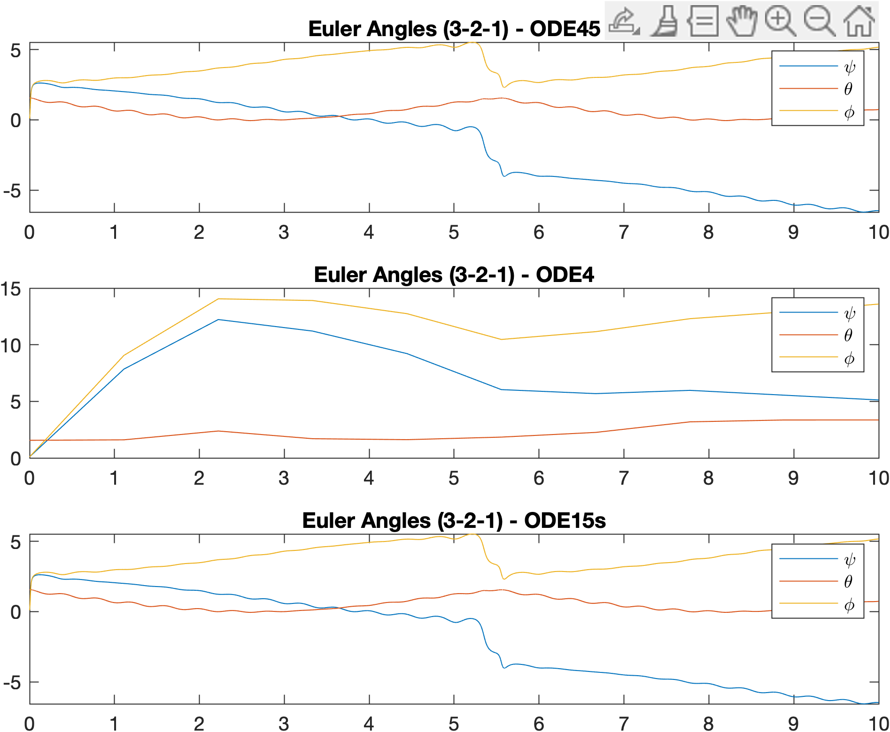
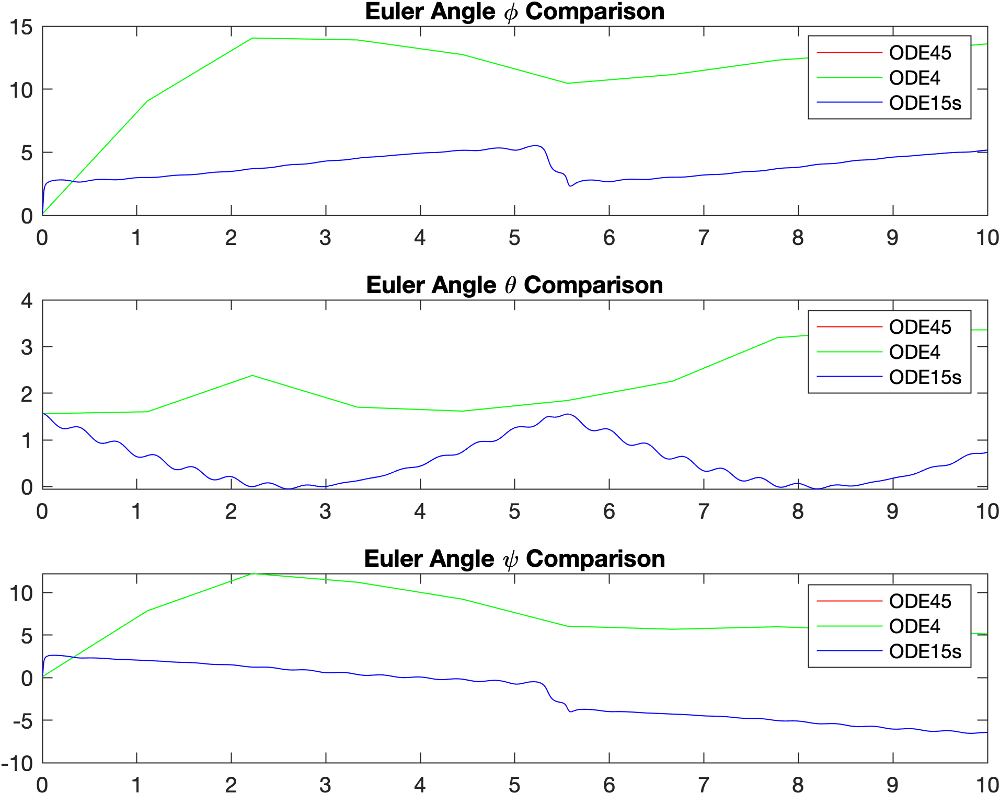
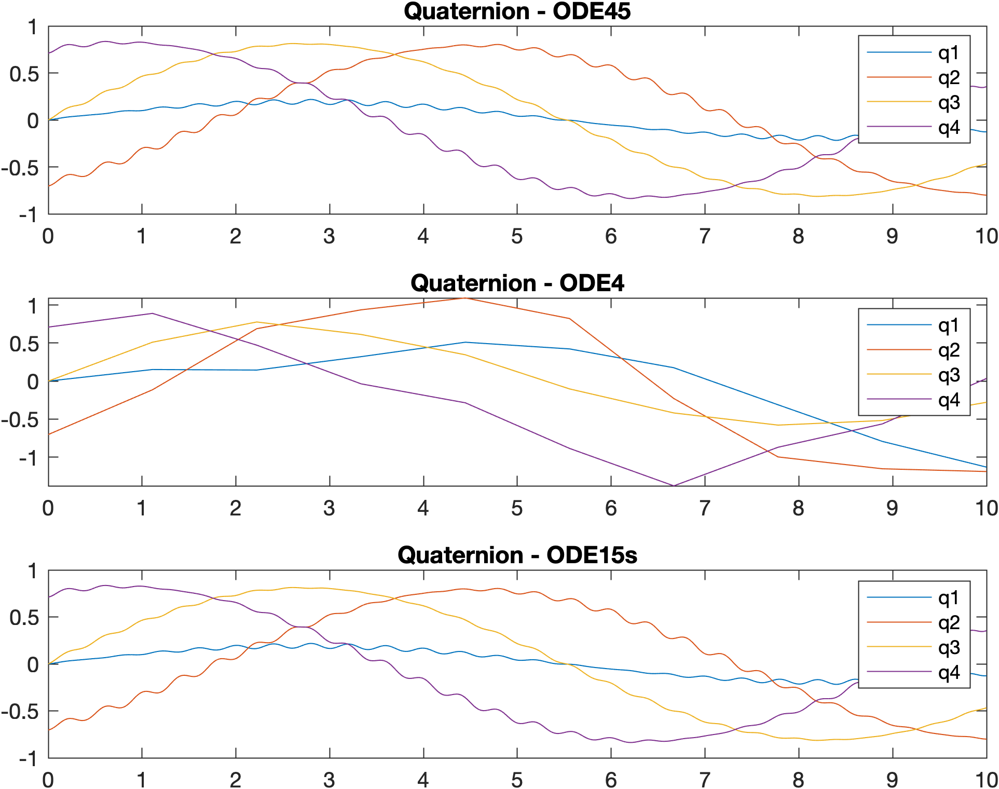
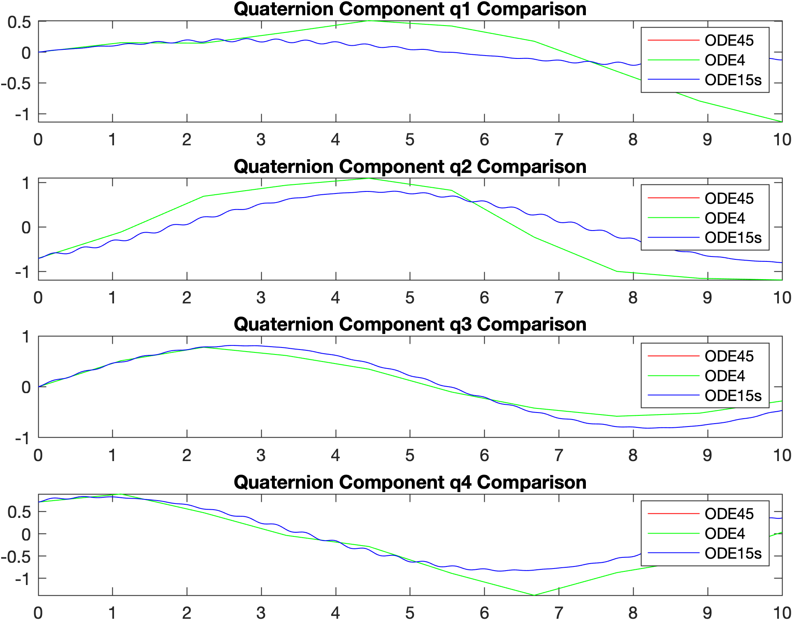
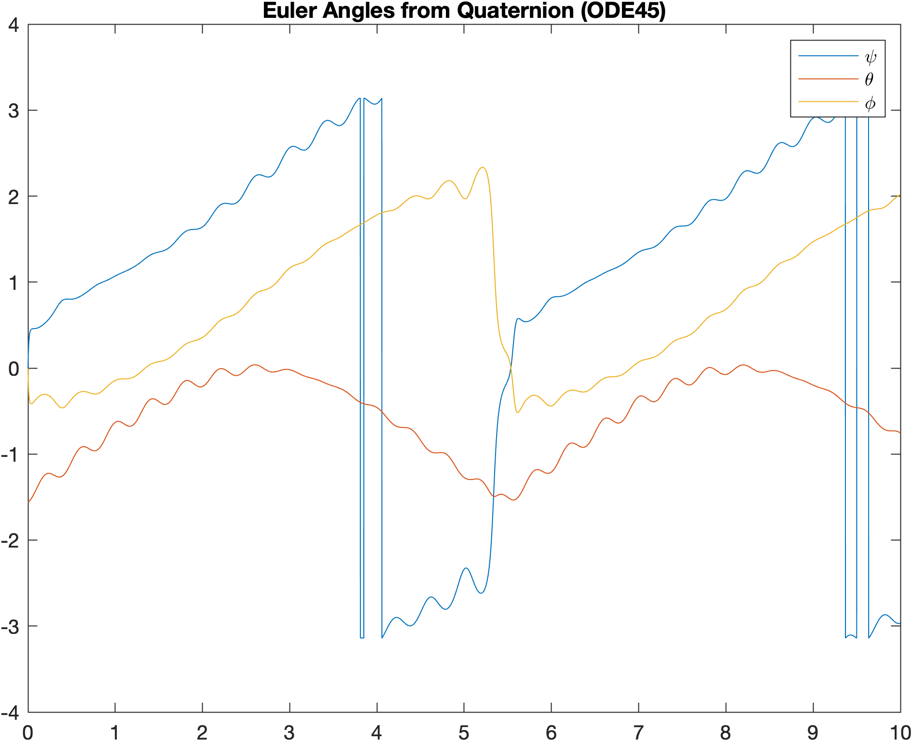
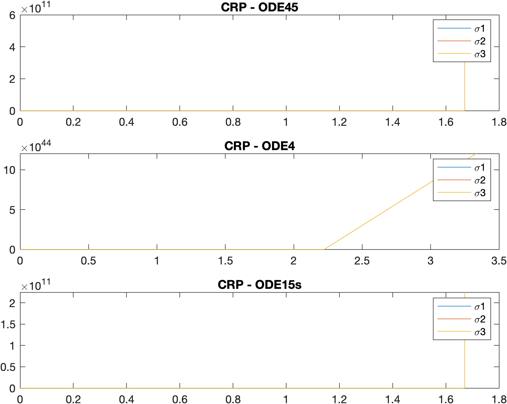
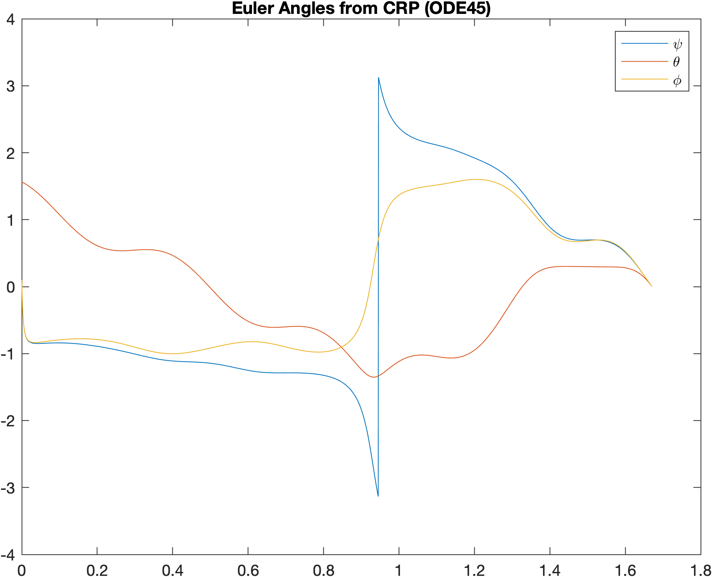

# Attitude Kinematics Simulation: Euler Angles vs. Quaternions vs. Classical Rodrigues Parameters

This repository contains a simulation to compare the performance of Euler angles, Quaternions, and Classical Rodrigues Parameters in attitude kinematics. The focus is on understanding how these methods handle singularities and ambiguities in the context of numerical integration. The project explores the challenges of simulating attitude motion close to or at singularity points, and investigates the impact of different numerical integrators on the singularity problem.

## Overview

Attitude kinematics describes the orientation of a rigid body in 3D space. Three popular methods to represent attitude are Euler angles, Quaternions, and CRPs:

* **Euler Angles:** Represent rotations as a sequence of three angles corresponding to rotations about fixed or moving axes. Euler angles are subject to singularities at specific values, where the system loses degrees of freedom, such as $\theta = \pm 90^\circ$ for the (3-2-1) set of Euler angles or $\theta = 0^\circ$ and $\theta = 180^\circ$ for the (3-1-3) set. This limitation can cause instability or ambiguity in large rotations.
* **Quaternions:** Provide a four-dimensional representation of rotations, avoiding the singularity problem by offering a continuous and smooth representation of rotations. However, quaternions have an inherent ambiguity: a quaternion and its inverse represent the same physical orientation.
* **Classical Rodrigues Parameters (CRPs):** Use a three-parameter representation, but encounter singularities at 180-degree rotations.

This simulation explores these differences, especially near singularities, and compares the three representations by integrating their kinematic equations using different numerical integrators.

* **Numerical Integrators:** The simulation compares three different numerical integrators:
    * `ode45` (variable step-size method)
    * `ode4` (fixed-step method)
    * `ode15s` (stiff integrator)
    The performance of these integrators is evaluated to assess their impact on capturing the singularity and resolving ambiguities in Euler angles, quaternions, and CRPs.
* **3D Animation:** A 3D animation is generated to visually analyze the attitude motion and its behavior near singularities for quaternions. The animation shows smooth rotations, demonstrating the absence of gimbal lock.

## Usage

1.  **Run the simulation:** In MATLAB 2024b, open and run the script `dynamicsAmbiguitiesUcles.m`. This will generate the necessary simulations and outputs for Euler angles, quaternions, and CRPs.
2.  **Analyze the results:** The results will be displayed as numerical outputs and 3D animations. You can compare the stability of the Euler angle, quaternion, and CRP representations, as well as the effects of different numerical integrators and tolerance settings on the singularity problem.
3.  **Adjust Parameters:** Modify the input angular motion trace, change the integrators, or adjust the tolerances to explore different scenarios or compare different conditions.

## Analysis

This simulation investigates the behavior of Euler angles, quaternions, and Classical Rodrigues Parameters (CRPs) when subjected to an angular velocity profile designed to approach a singularity for Euler angles. The initial Euler angles are set close to the singularity ($\theta \approx \pi/2$) for the 3-2-1 sequence.

**Euler Angles (3-2-1):**

* The simulation demonstrates the vulnerability of Euler angles to singularities. The `ode4` solver, using a fixed step size, exhibits significant deviations from the solutions obtained by `ode45` and `ode15s`. This is because `ode4` cannot adapt its step size to handle the rapid changes in Euler angles near the singularity.
* `ode45` and `ode15s`, which use variable step sizes, perform significantly better. They reduce their step sizes when approaching the singularity, maintaining accuracy. This showcases the advantage of adaptive step-size methods in handling such scenarios.
* The plots of the individual euler angles show the deviation of the ode4 solver, and the relative consistency of the ode45 and ode15s solvers.

**Quaternions:**

* Quaternions, as expected, exhibit smooth and continuous behavior across all three ODE solvers. This confirms their robustness in avoiding singularities.
* The conversion of quaternion solutions back to Euler angles demonstrates that the physical rotation remains smooth, even when the initial Euler angles were close to a singularity.
* The plots of the quaternion components show the relative consistency of all three solvers.
* The plot of euler angles that were converted from the quaternions shows how well the quaternions handle the singularity.

**Classical Rodrigues Parameters (CRPs):**

* CRPs also show consistent behavior across the ODE solvers, indicating their stability in this scenario.
* The conversion of CRP solutions back to Euler angles again results in smooth rotations, highlighting that the underlying motion is well-behaved.
* The plots of the crp components show the relative consistency of all three solvers.
* The plot of euler angles that were converted from the crps shows how well the crps handle the singularity.

**ODE Solver Comparison:**

* **`ode4`:** Fixed step size makes it sensitive to singularities. It's the least accurate in this scenario.
* **`ode45`:** Variable step size provides better accuracy and handles singularities effectively.
* **`ode15s`:** A stiff solver, also with variable step size, is robust and accurate, particularly for systems with rapid changes.
* The tolerance of the ode solvers has a large effect on the accuracy of the results. By setting a very low tolerance, the results of ode45 and ode15s become very similar.

**3D Animation:**

* The 3D animation using quaternions visually confirms the smoothness of the rotation, even when the Euler angles are near a singularity. This reinforces that the singularity is a representational issue, not a physical discontinuity.

**Conclusion:**

This simulation effectively demonstrates the advantages of using quaternions and CRPs over Euler angles in scenarios involving or approaching singularities. The choice of ODE solver is crucial, with variable step-size methods (`ode45`, `ode15s`) providing superior accuracy and stability compared to fixed step-size methods (`ode4`) when dealing with singularities.

## Tools and Assistance

This project utilized several tools to enhance its quality and clarity. Specifically:

* **ChatGPT and Gemini AI:** These AI language models were employed for grammar checking, improving code clarity, and ensuring conciseness by removing redundancies.

## Results

Here are the images produced by the simulation:

1.  **`euler_angles_by_ode.png`:**
    * This image displays the Euler angles ($\psi$, $\theta$, $\phi$) over time, as computed by the three different ODE solvers (`ode45`, `ode4`, `ode15s`).
    * It visually demonstrates how `ode4` deviates significantly from the other two solvers, especially in the $\theta$ (theta) angle, near the singularity point.
    * This shows the difference in accuracy that is caused by fixed step solvers versus variable step solvers.
    

2.  **`euler_angles_by_angle.png`:**
    * This image compares the Euler angle values from the three solvers for each angle separately.
    * It clearly shows the divergence of `ode4`'s solution, particularly in the $\theta$ component, while `ode45` and `ode15s` remain closely aligned.
    * This further shows the difference in accuracy that is caused by fixed step solvers versus variable step solvers.
    

3.  **`quaternion_components.png`:**
    * This image plots the four components of the quaternion ($q_1$, $q_2$, $q_3$, $q_4$) over time for each ODE solver.
    * All three solvers produce very similar results, indicating that quaternions are not affected by the singularity in the same way as Euler angles.
    * This shows the numerical stability of quaternions.
    

4.  **`quaternion_components_comparison.png`:**
    * This image shows each of the 4 quaternion components, and overlays the results of each of the three ode solvers.
    * This further shows the numerical stability of quaternions.
    

5.  **`euler_from_quaternion.png`:**
    * This image displays the Euler angles obtained by converting the quaternion solutions from `ode45` back to Euler angles.
    * The plot shows smooth, continuous behavior, confirming that the underlying rotation is well-behaved, even when the initial Euler angles were close to a singularity.
    * This shows how quaternions can be used to avoid singularities.
    

6.  **`crp_components.png`:**
    * This image shows the 3 components of the Classical Rodrigues Parameters over time for each ODE solver.
    * It demonstrates that CRPs, like quaternions, maintain stability and consistency across the different integration methods.
    * This highlights the robustness of CRPs in handling attitude kinematics, even when approaching singularities in other representations.
    

7.  **`euler_from_crp.png`:**
    * This image shows the Euler angles obtained by converting the CRP solutions from `ode45` back to Euler angles.
    * The plot shows smooth, continuous behavior, proving that CRPs also maintain a well-behaved rotation even when the initial Euler angles were close to a singularity.
    * This further confirms that CRPs can be used to avoid singularities.
    

8.  **`attitude_animation_export_fast.gif`:**
    * This animated GIF visually demonstrates the 3D rotation of a frame using quaternions.
    * It shows a smooth, continuous rotation, effectively illustrating the absence of gimbal lock and the stability of quaternion representation.
    * This animation provides a clear visual confirmation of the theoretical advantages of using quaternions for attitude kinematics.
    

## Disclaimer

Please note that the code used to generate the animated GIF (`attitude_animation_export_fast.gif`) from the 3D animation is a separate script. Due to its longer execution time and the fact that it only needed to be run once to produce the GIF, it has not been included in this repository. The primary focus of this repository is to demonstrate the numerical simulation and comparison of attitude kinematics representations.
